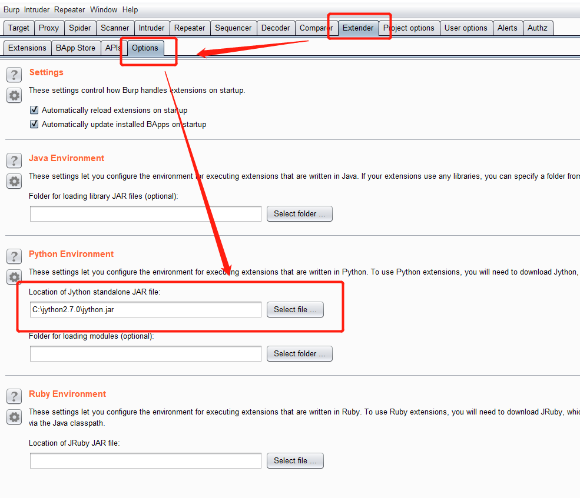
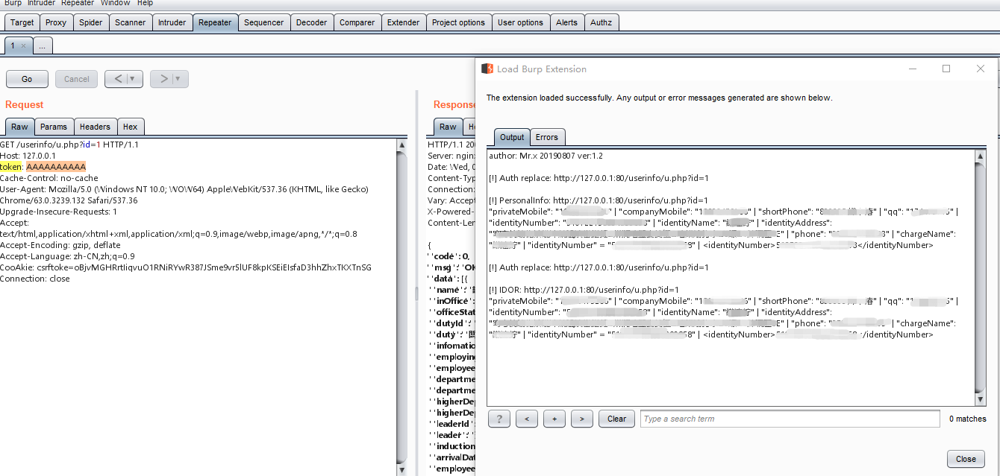
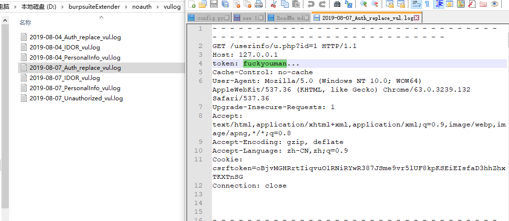

基于敏感数据IAST模式的Burpsuite检测插件
=======================================
	
# 一、说明
	
基于敏感数据IAST模式的Burpsuite插件，用于甲乙方在做渗透测试或是应用系统安全检测时半自动发现接口返回敏感数据，并对该接口进行未授权、越权等简单测试。当前的检测逻辑还是比较简单的，各位可根据自己的实际业务对检测逻辑进行优化。
	
### 已完成：
	
+ 敏感信息泄漏检测
+ 垂直越权访问检测
+ 未授权访问检测
+ 水平越权访问检测(解释请求报文,自动遍历int类型的ID)
	
### 计划中：
	
+ 欢迎提建议,不建议开始潜水
	
# 二、部署说明

	需要安装jython2.7.0，并在burpsuite启用，把浏览器代理设置为burpsuite，然后人工触发应用系统功能即可。
- [下载 jython2.7.0](http://search.maven.org/remotecontent?filepath=org/python/jython-installer/2.7.0/jython-installer-2.7.0.jar)
- 
- 
- 
- 
	
# 三、目录说明

	.
	│─config.py      检测规则配置文件
	│─Detection.py   检测逻辑主体
	│─hackhttp.py    Http请求方法封装模块
	│─Logical.py     burpsuite插件入口文件
	│─unit.py        公共模块
	│
	└─vullog         检测出来的漏洞记录文件存放目录，auth_replace：越权访问、PersonalInfo：敏感信息泄漏、Unauthorized：未授权访问、IDOR：水平越权。 
	
# 四、检测配置`config.py`
	
```
	# 漏洞记录文件存放目录
	vullogpath = './vullog/'
	
	# URL去重检测开关, 开启：True，关闭：False
	url_hash = True
	
	# 自动清除http请求中head中的身份认证字段,大小写敏感
	rm_token_keys = ['token', 'Cookie']
	
	# 自定义response中json数据类型的敏感信息字段定义,大小写不敏感
	personalinfo_json_keys = ['identity', 'phone', 'webchat', 'email', 'qq', 'mobile', 'chargename']
	
	# 自定义搜索出来的敏感信息进行过滤字段,大小写不敏感
	re_filter_keys = ['dont_delete_this_default_vaule', 'mobileDisplay', 'highSpeedCardNumber', 'payeeBankCode', 'payeeBankType']
	
	# 自定义忽略文件类型,小写敏感
	filter_files = ['.css', '.js', '.jpg', '.jpeg', '.gif', '.png', '.bmp', '.html', '.htm', '.swf', '.svg']
	
	# 自定义一定要进行权限安全检测的URL黑名单，支持正则
	black_urls = ['dont_delete_this_default_vaule', '\?auth.\w+']
	
	# 自定义替换身份认证信息如：token、Cookie等信息，用于越权测试，支持正则
	replace_auth = {'token':{
							'recmd': 'token: .*?',
							'replace': 'token: fuckyouman...'
							}
					}
	
	# 自定义平行越权越权测试规则，支持正则
	idor_rule = {'param': '\d+', # ID参数值检测规则，只支持int型
				'result': '(?:1[3-9])\d{9}' # 敏感信息的判断标准
				}
```
	
# 版本
	
+ 作者: Mr.x
+ 版本: 1.2
+ 时间: 20190807